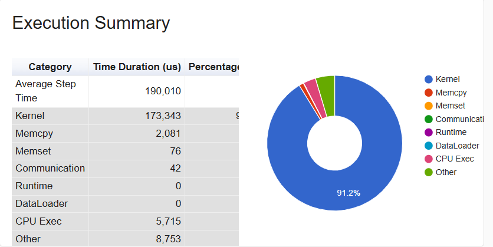
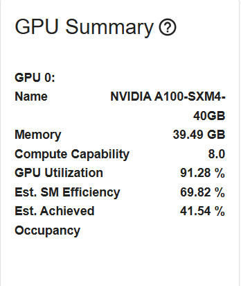
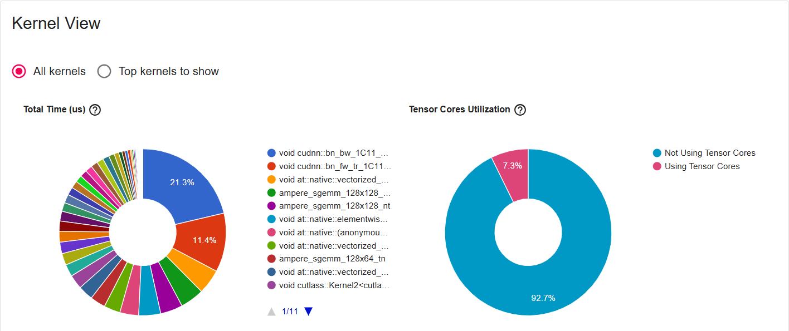
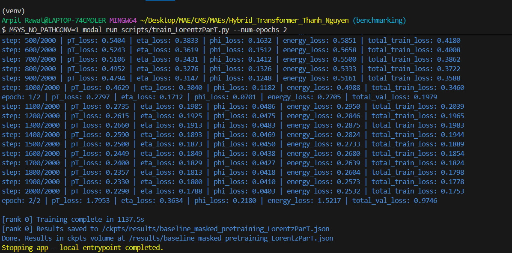
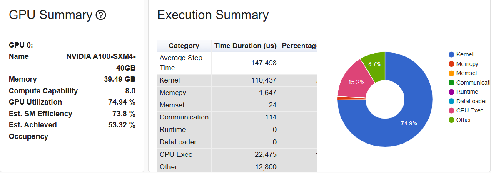
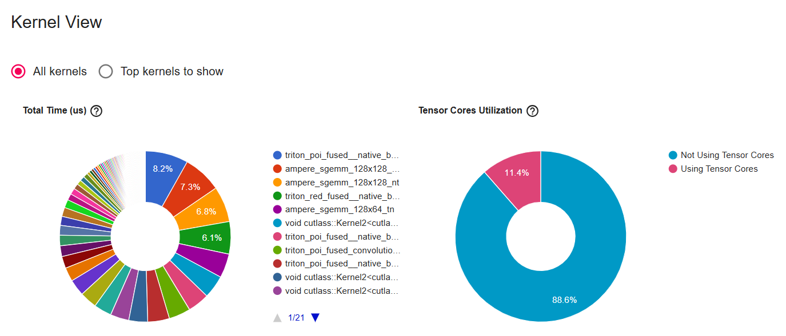
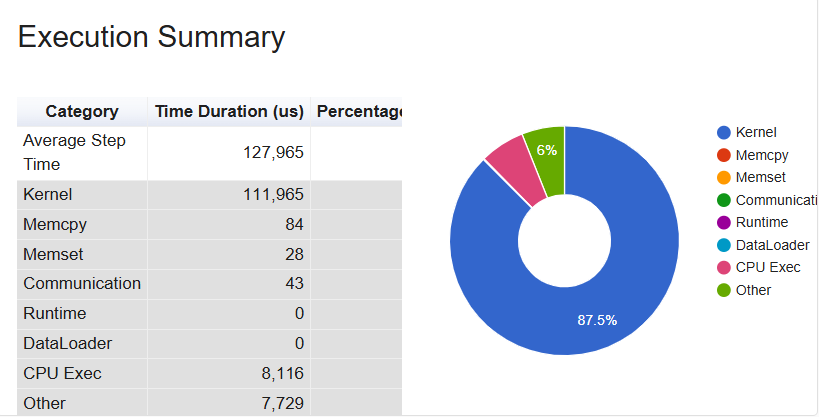
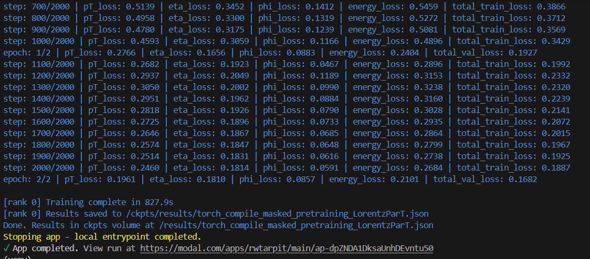
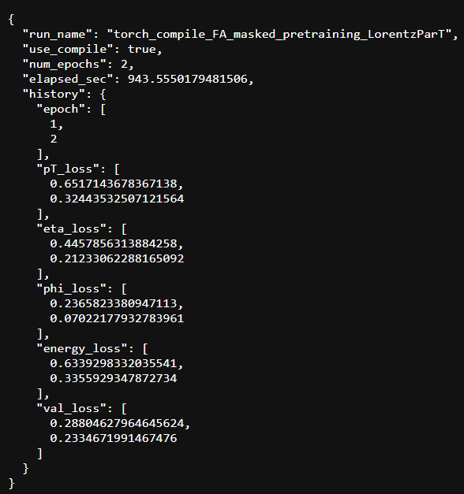
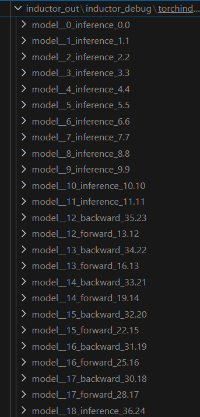

# Event Classification With Masked Transformer Autoencoders Test Task

> **GSoC 2026 | ML4SCI | Event Classification with Masked Transformer Autoencoders**    
> Model: LorentzParT (hybrid L-GATr + ParT encoder)  
> Hardware: NVIDIA A100*2 (40GB) (via Modal Labs)

---

## Overview

This test task profiles and optimises the training pipeline for the LorentzParT MAE pretraining task on the JetClass dataset. Starting from a vanilla baseline of existing codebase, we systematically identify bottlenecks using the PyTorch Profiler, apply optimisations, and analyse the compiled Triton kernels generated by `torch.compile` to find remaining opportunities.

**Key result: `torch.compile(mode="reduce-overhead")` achieves around 32% reduction in per-step time versus the eager baseline, driven by Triton kernel fusion and CUDA graph replay.**

---

## Table of Contents

1. [Environment & Dataset](#environment--dataset)
2. [Baseline Profiling](#baseline-profiling)
3. [torch.compile Optimisation](#torchcompile-optimisation)
4. [Benchmark Results](#benchmark-results)
5. [Inductor Graph Analysis](#inductor-graph-analysis)
6. [Generated Triton Kernels](#generated-triton-kernels)
7. [Remaining Bottlenecks & Future Work](#remaining-bottlenecks--future-work)

---

## Environment & Dataset

| Component | Details |
|-----------|---------|
| GPU | NVIDIA A100*2 40GB SXM4 |
| Framework | PyTorch + Triton |
| Infrastructure | Modal Labs (A100 on-demand) |
| Model | LorentzParT |
| Config | `embed_dim=128, num_heads=8, num_layers=8, batch_size=1000, mask=True` |

**Dataset split :**

The dataset used is the 5M validation dataset further divided into train-val-test split without any data leak.
each train, val and test consists of 10 root files (1 each class), all being distinct from each other.
Though the test split has not been used in the benchmarking process as the intend was to benchmark training time instead of numerical accuracy.

| Split | Files | Events |
|-------|-------|--------|
| Train | `*_120.root` | 10 × 100k = 1M |
| Val | `*_121.root` | 10 × 100k = 1M |
| Test | `*_122.root` | 10 × 100k = 1M |

---

## Baseline Profiling

Profiling was performed using the PyTorch Profiler with CUDA activity tracing, recording 5 active steps after 5-10 warmup steps.

### Baseline Step Time Breakdown


**Avg step time: 190,019 µs**

As shown in the execution summary, the pipeline is primarily compute bound, ie GPUs are taking most time to perform the maths.
This gives us opportunity to optimise the default ops and kernels.
Suprisingly the data transfer and communication is minimal, contradictory from what was expected given root files are unwrapped on the fly in the data loading pipeline. (this may not be accurate profile of data loading since the setup only uses 2 GPUs, so on more GPUs maybe we can get an accurate picture when there are more GPUs starving for data).



Again the low occupancy and efficiency of cores gives concrete evidence that the setup is compute bound.

### GPU Utilisation Metrics
The low Tensor Core usage (7.3%) immediately identifies float32 matmuls as the primary bottleneck — the A100 is designed to spend the vast majority of compute time in Tensor Cores for bf16/fp16 workloads. This needs to be addressed as well but keeping in mind the numerical accuracy and trade-offs that comes with speeding with lower precision dtypes.

The kernel profiling shows major kernels 



### Few Dominant Kernels (Baseline)

| Kernel | Issue |
|--------|-------|
| `cudnn::bn_bw_1C11` |  BatchNorm backward pass |
| `cudnn::bn_fw_1C11` |  BatchNorm forward pass |
| `ampere_sgemm_128x128_nn/nt` |CUTLASS tuned matmul kernels but not using Tensor Core |

I checked the BatchNorm appearances in codebase, and surprisingly only `InteractionEmbedding` uses it
```python
class InteractionEmbedding(nn.Module):
    def __init__(
        self,
        num_interaction_features: int = 4,
        pair_embed_dims: List[int] = [64, 64, 64, 8]
    ):
        super(InteractionEmbedding, self).__init__()
        input_dim = num_interaction_features
        layers = [nn.BatchNorm1d(input_dim)]
        for dim in pair_embed_dims:
            layers.extend([
                nn.Conv1d(input_dim, dim, kernel_size=1),
                nn.BatchNorm1d(dim),
                nn.GELU()
            ])
            input_dim = dim
            
        self.embed = nn.Sequential(*layers)
```
This is a major bottleneck as batchnorm requires synchronization barriers and is notoriously hard to parellelise.
This can be optimised by fusion with ops around it (torch compile does it to some extent, we will see below) or can be replaced with fast LayerNorm fused kernel given it is able to provide near lossless performance.

Similarly, as I said kernel fusion and some well ablated replacements can give major computational boosts, and can be sought for if they fall in similar numerically accurate regime.

---

## Benchmarking Results


The existing pipeline when ran on A100*2 (40 GiBs) for 2 epochs, takes approx. of 1137 secs with training and validation setup.
(The test setup was excluded to mimic actual run on a small scale with only train and val dataset).

There is subtle error in final val loss spiking from epoch 2.
This doesn't occur in torch compile's benchmarking, so doesn't seem to be a bug in pipeline. I will  re-run it and inspect if it happens again.


## torch.compile Optimisation

Three configurations were profiled and compared against the eager baseline.

### Configuration 1: `torch.compile(mode="default")`
```python
model = torch.compile(model, mode="default")
```

**Avg step time: 147,498 µs (−22% vs baseline)**



Torch compile is able to fuse majority of small ops into single kernel and thus is able to give almost a quarter of improvement in avg step time. Improved SM efficiency and occupancy further supports the argument.

And as expected CPU time increases with torch compile due to torch inductor's overhead that has to analyse the whole CUDA graph and write triton kernels on the fly in first few iterations.



Furthermore torch compile fuses many kernels together and replaces them with JIT written triton kernels.
And as we can see GEMM kernels are still being dispatched as triton by default can't fuse them as they are external kernels.
An opportunity (but very hard to beat CUTLASS or CUBLASS kernels) rises here to write custom kernels that can replace these external kernels with surrounding ops and taking leverage of tensor cores as well

Next we will try to squeeze more gains from torch compile and analyse what torch compile was able to and what it was not able to fuse.

---

### Configuration 2: `torch.compile(mode="reduce-overhead")` — CUDA Graphs
```python
model = torch.compile(model, mode="reduce-overhead")
```

`reduce-overhead` mode captures the entire forward+backward as a CUDA graph, replacing repeated kernel launches with a single `cudaGraphLaunch`. This eliminates CPU dispatch overhead and minimises host-device synchronisation.



**Avg step time: 127,965 µs (−32% vs baseline)**

With `reduce-overhead` mode we were able to squeeze more from torch compile as now request to CPU to dispatch each kernel again and again for each step is reduced.
The 96% reduction in Memcpy time is the clearest signature of CUDA graph replay — repeated host-device transfers are replaced by pre-recorded graph execution.

Although the kernel time remains same hinting towards that torch compile has squeezed out peak possible fusion and kernels it could manage to.

The benchmarking time decreases by a good **310 seconds (27%)** :


---

### Configuration 3: `flash_attention backend for ``pmha`` + torch compile`

I also tried to use flash attention backend from `torch.nn.functional.scaled_dot_product_attention` since current implementation uses naive `nn.MultiHeadAttention` which torch compile fuses down into a bunch of kernels instead of one.

But the results were lower than torch compile itself.

 Upon inspecting, it turns out that  to use flash-attention backend in pytorch, `num_heads` should be atleast 16(8 in our case). So this also holds optimisation scope based on ablations and architecture decisions (either to increase `num_heads` or write custom triton kernel for `pmha` which also takes `U` vector into account).

 

## Remaining Bottlenecks & Future Work

Even though torch compile has been able to provide a big optimisation already, thanks to its fused kernels, we can still push for more benefits.

If we inspect the CUDA graph created by `torch.compile(..., mode=``reduce-overhead``)` it shows many graph breaks. These graph breaks means that CPU has to intervene again to dispatch kernels again in each step. Possible likely reasons for this are the operations that torch compile isn't able to fuse, dynamic input shapes, calls to CPU (for ex: print statements).

Few points of graph breaks that i was able to understand were:
 - lgatr's Equilinear layer
 - Interaction Embedding



If we are able to eliminate/reduce graph breaks, we can achieve a single CUDA graph for forward pass and backward pass respectively. This leads to zero CPU intervention for kernel dispatching and therefore can optimise the pipeline even more.
For multi GPU setup, this may benefit if data loading pipeline turns out to be slower, as then CPU can allocate resources to data prefetching instead.

This leaves us with another path to explore.

---

## Conclusions

This report was completed as part of the test task for GSoC 2026, **ML4SCI — Event Classification with Masked Transformer Autoencoders**.

The goal was to understand the LorentzParT training pipeline deeply enough to identify real bottlenecks and propose grounded optimizations.

**What was found through analysis:**

torch compile already provides a great and optimised baseline for the pipeline. Writing custom kernels can vastly be ruled out of project scope and only well understood graph breaks and overall pipeline optimisation should be priortised over custom kernels for  what torch compile already does efficiently.

**What the ablations ruled out:**

SDPA (FlashAttention) was tested and showed a regression at N=128 — compile's `baddbmm` + fused softmax is already optimal at this sequence length, and FlashAttention's advantage only materializes at changing model hyperparameters.

**What this means for the GSoC project:**

The profiling work can be used as a baseline for final deliverable project, where majority effort can be oriented towards exploring new architectures (for ex: JEPA), ablation and benchmarking results.

## References

- Qu, H., Li, C., & Qian, S. (2022). [Particle Transformer for Jet Tagging](https://arxiv.org/abs/2202.03772). *ICML 2022*.
- Brehmer, J. et al. (2023). [L-GATr: Geometric Algebra Transformers for Large-Scale Simulations](https://arxiv.org/abs/2305.18415).
- PyTorch. [torch.compile documentation](https://pytorch.org/docs/stable/generated/torch.compile.html).
- Dao, T. et al. (2022). [FlashAttention: Fast and Memory-Efficient Exact Attention](https://arxiv.org/abs/2205.14135).